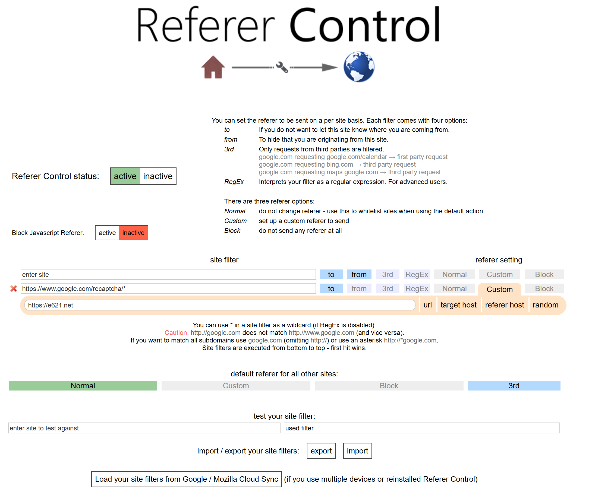
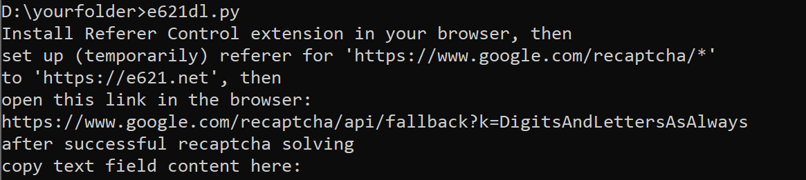
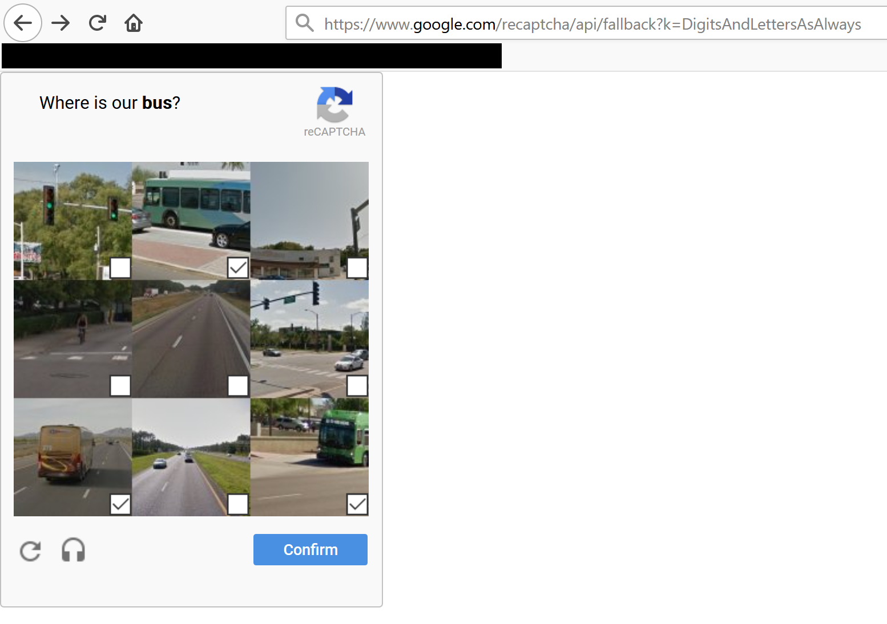
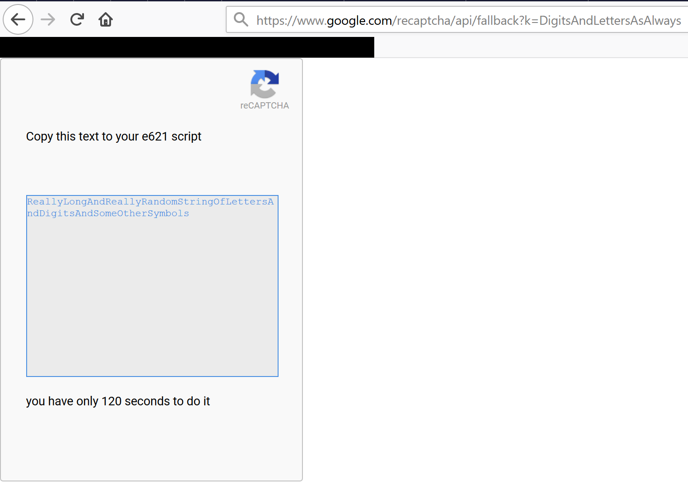
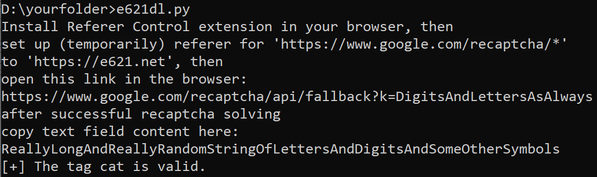

# How to work with Cloudflare recaptcha

First, you have to install Referer Control for your browser

[Referer Control for Chrome](https://chrome.google.com/webstore/detail/referer-control/hnkcfpcejkafcihlgbojoidoihckciin)

[Refere Control for Firefox](https://addons.mozilla.org/en-US/firefox/addon/referercontrol/)



For copypaste:

```
https://www.google.com/recaptcha/*
```

```
https://e621.net
```

Note: `https`, not `http`.

Now, if you really have a problem with Cloudflare, you should see something like this:


To copy/paste from/to comman line in Windows, right click on the title bar and go to edit menu, all the options you need are there (copy, paste, select). On Windows 10, you can just select text as usual, left mouse button press and hold and then single right button click, and paste with single right button click if nothing is selected.

So you open `https://www.google.com/recaptcha/api/fallback?k=DigitsAndLettersAsAlways` in you browser and solve a captcha. Obviously, `DigitsAndLettersAsAlways` part is unique:


Here is text you'll get for your trouble:


After you copy it and press `Enter` if all is fine, e621dl should work as usual:

